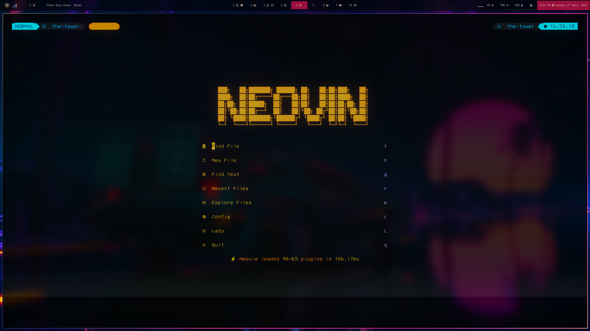
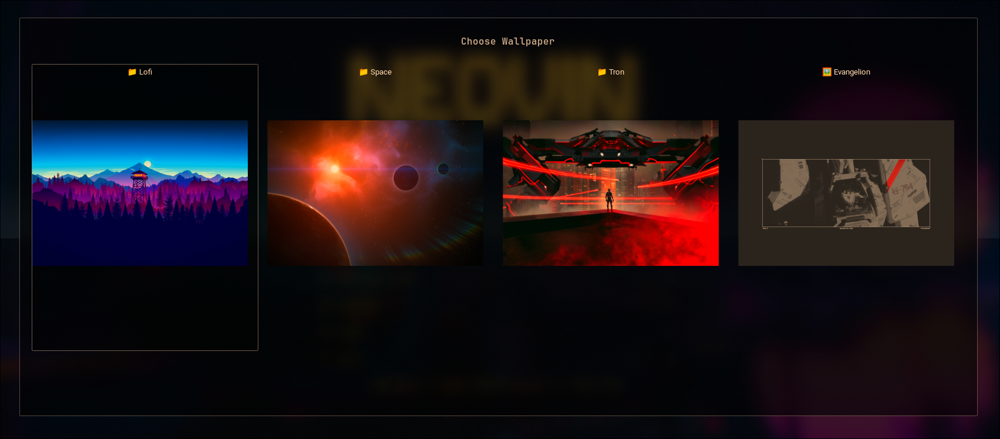
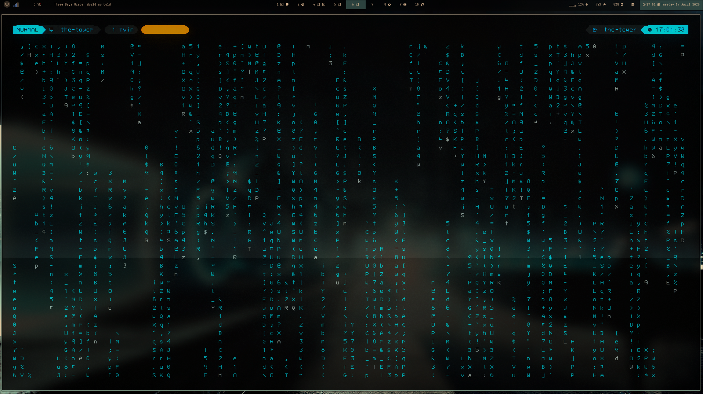
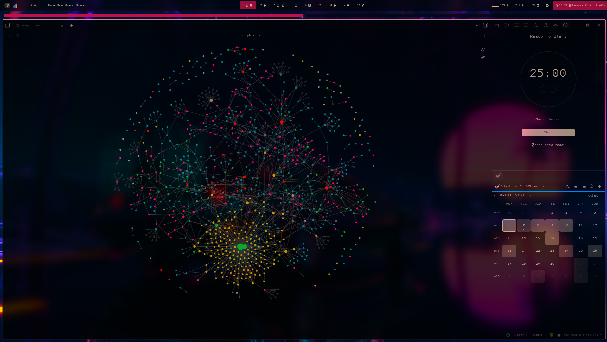

# The Tower

A declarative, modular Nix configuration for dual-target deployment: **NixOS** (notebook) and **Home Manager standalone** (Arch Linux main rig).

Part of **The Grid** — a cohesive system architecture managed through Nix flakes and `agenix` secret management.

---

## Showcase






---

## Overview

The Tower is a complete, reproducible desktop environment configuration deployed across two targets:

1. **`notebook`** — NixOS system configuration (full system control)
2. **`main`** — Home Manager standalone on Arch Linux (user-level only)

Both targets share a common Home Manager configuration and modular package definitions. The system manages:

- **Window Manager:** Hyprland (Wayland)
- **Terminal & Shell:** Kitty + Fish
- **Editor:** Neovim (Lazy.nvim, LSP, Treesitter, Telescope)
- **Utilities:** Tmux, Yazi, Starship, Rofi, Lazygit, Ripgrep, FZF
- **Theming:** GTK (Sweet-Ambar-Blue-Dark), Icons (Qogir-dark), Fonts (JetBrains Mono, 3270 Nerd Font)
- **Wayland Ecosystem:** Waybar, Hyprlock, Hypridle, Sway Notification Center, Wallust
- **Secrets:** Managed via `agenix` (encrypted, version-controlled)

All configuration is declarative, modular, and version-controlled.

---

## Directory Structure

```
.
├── flake.nix                 # Nix flake entry point (nixpkgs-unstable, home-manager, agenix)
├── flake.lock               # Locked dependency versions
│
├── nix/
│   ├── hosts/
│   │   └── notebook/        # NixOS system configuration (notebook target)
│   │       ├── default.nix  # System configuration entry point
│   │       ├── hardware-configuration.nix
│   │       ├── audio.nix    # Audio (PipeWire, ALSA)
│   │       ├── services.nix # System services
│   │       └── secrets/     # agenix encrypted secrets
│   │           ├── secrets.nix
│   │           └── secrets.age (encrypted)
│   │
│   ├── home/
│   │   ├── main.nix         # Home Manager config for main (Arch)
│   │   ├── notebook.nix     # Home Manager config for notebook (NixOS)
│   │   ├── shared.nix       # Shared Home Manager configuration
│   │   ├── dotfiles.nix     # Dotfile symlinks (nvim, hypr, kitty, etc.)
│   │   ├── git.nix          # Git configuration
│   │   ├── gtk.nix          # GTK theming
│   │   ├── tmux.nix         # Tmux configuration
│   │   └── activation.nix   # Activation scripts
│   │
│   └── packages/
│       ├── cli.nix          # CLI tools (ripgrep, fzf, lazygit, yazi, etc.)
│       ├── languages.nix    # Language runtimes (go, rust, python, node, etc.)
│       ├── wayland.nix      # Wayland ecosystem (hyprland, waybar, hyprlock, etc.)
│       └── appearance.nix   # Appearance (fonts, themes, icons, wallust)
│
├── nvim/                    # Neovim config (Lazy.nvim, LSP, Telescope, obsidian.nvim)
├── hypr/                    # Hyprland + Hyprlock + Hypridle
├── waybar/                  # Waybar status bar (multiple themes)
├── kitty/                   # Kitty terminal emulator
├── fish/                    # Fish shell config
├── rofi/                    # Rofi launcher (multiple themes)
├── tmux/                    # Tmux multiplexer
├── yazi/                    # Yazi file manager
├── starship/                # Starship prompt
├── swaync/                  # Sway Notification Center
├── wallust/                 # Wallust color generation
└── lazygit/                 # Lazygit configuration
```

---

## Quick Start

### Prerequisites

- **For `notebook` (NixOS):** NixOS installed, Nix flakes enabled
- **For `main` (Arch):** Arch Linux, Nix package manager installed, Home Manager
- Git

### Installation

1. **Clone the repository:**
   ```bash
   git clone https://github.com/kasatto/the-tower ~/.the-grid/the-tower
   cd ~/.the-grid/the-tower
   ```

2. **Set up secrets (agenix):**
   ```bash
   # Decrypt and place secrets in nix/hosts/notebook/secrets/
   # (Requires agenix private key in ~/.config/sops/age/keys.txt)
   ```

3. **Deploy to your target:**

   **For NixOS (notebook):**
   ```bash
   sudo nixos-rebuild switch --flake .#notebook
   ```

   **For Arch Linux with Home Manager (main):**
   ```bash
   nix run home-manager/master -- switch --flake .#main
   ```

4. **Reboot or restart your session** to activate Hyprland and all services.

---

## Configuration

### Deployment Targets

The flake defines two outputs:

| Target | Type | Command |
|--------|------|---------|
| **`notebook`** | NixOS system | `sudo nixos-rebuild switch --flake .#notebook` |
| **`main`** | Home Manager (Arch) | `nix run home-manager/master -- switch --flake .#main` |

### Modular Structure

**Home Manager Configuration** (`nix/home/`):
- `shared.nix` — Common configuration for both targets
- `main.nix` — Arch-specific Home Manager config
- `notebook.nix` — NixOS-specific Home Manager config
- `dotfiles.nix` — Symlinks for all application configs (nvim, hypr, kitty, etc.)
- `git.nix` — Git configuration
- `gtk.nix` — GTK theming and appearance
- `tmux.nix` — Tmux configuration
- `activation.nix` — Post-activation scripts

**Packages** (`nix/packages/`):
- `cli.nix` — CLI tools (ripgrep, fzf, lazygit, yazi, tmux, starship, etc.)
- `languages.nix` — Language runtimes (Go, Rust, Python, Node.js, etc.)
- `wayland.nix` — Wayland ecosystem (Hyprland, Waybar, Hyprlock, Hypridle, Sway Notification Center)
- `appearance.nix` — Fonts, themes, icons, Wallust

**System Configuration** (`nix/hosts/notebook/`):
- `default.nix` — NixOS system entry point
- `hardware-configuration.nix` — Hardware-specific settings
- `audio.nix` — PipeWire and ALSA configuration
- `services.nix` — System services and daemons
- `secrets/` — agenix encrypted secrets

### Secrets Management (agenix)

Secrets are encrypted with `agenix` and stored in version control:
```
nix/hosts/notebook/secrets/
├── secrets.nix      # Secret definitions
└── secrets.age      # Encrypted secrets file
```

To decrypt and use secrets:
1. Ensure your agenix private key is in `~/.config/sops/age/keys.txt`
2. Secrets are automatically decrypted during deployment

### Adding New Packages

Edit the appropriate file in `nix/packages/`:
```nix
# nix/packages/cli.nix
{ pkgs, ... }:
{
  home.packages = with pkgs; [
    # ... existing packages
    newpackage
  ];
}
```

Then apply: `sudo nixos-rebuild switch --flake .#notebook` or `nix run home-manager/master -- switch --flake .#main`

### Linking New Dotfiles

Edit `nix/home/dotfiles.nix`:
```nix
home.file = {
  ".config/appname".source = ../../appname;
  # ... other dotfiles
};
```

### Theming

- **GTK Theme:** Sweet-Ambar-Blue-Dark-v40
- **Icon Theme:** Qogir-dark
- **Fonts:** JetBrains Mono Nerd Font (primary), 3270 Nerd Font Mono (Kitty), Roboto, Inter
- **Color Generation:** Wallust (auto-generates colors from wallpapers)

Edit `nix/packages/appearance.nix` to change themes or fonts.

---

## Key Components

### Neovim
- **Plugin Manager:** Lazy.nvim
- **LSP:** Native LSP with multiple language servers
- **Fuzzy Finder:** Telescope
- **Treesitter:** Syntax highlighting and text objects
- **Knowledge Base:** obsidian.nvim for Zettelkasten integration
- **UI Enhancements:** Snacks.nvim

### Hyprland
- **Window Manager:** Hyprland (Wayland compositor)
- **Lock Screen:** Hyprlock
- **Idle Management:** Hypridle
- **Wallpaper:** Hyprpaper
- **Daemon:** Pyprland (for additional functionality)

### Terminal & Shell
- **Terminal:** Kitty (GPU-accelerated, 3270 Nerd Font Mono)
- **Shell:** Fish (interactive, user-friendly)
- **Prompt:** Starship (fast, customizable)
- **Multiplexer:** Tmux

### Utilities
- **File Manager:** Yazi (fast, keyboard-driven)
- **Launcher:** Rofi (with multiple themes)
- **Git Client:** Lazygit (TUI)
- **Search:** Ripgrep (rg), FZF
- **Clipboard:** wl-clipboard (Wayland)

---

## Development

### Updating Dependencies

To update Nix flake inputs:
```bash
nix flake update
```

Then apply to your target:
```bash
# For NixOS (notebook)
sudo nixos-rebuild switch --flake .#notebook

# For Arch (main)
nix run home-manager/master -- switch --flake .#main
```

### Validating Configuration

Check flake syntax:
```bash
nix flake check
```

### Adding New Packages

1. Determine the category (CLI, language, Wayland, appearance)
2. Edit the appropriate file in `nix/packages/`:
   ```nix
   # nix/packages/cli.nix
   { pkgs, ... }:
   {
     home.packages = with pkgs; [
       # ... existing packages
       newpackage
     ];
   }
   ```
3. Apply the configuration

### Adding New Application Configurations

1. Create a new directory (e.g., `appname/`) with config files
2. Edit `nix/home/dotfiles.nix` and add:
   ```nix
   home.file = {
     ".config/appname".source = ../../appname;
   };
   ```
3. Apply the configuration

### Managing Secrets

To add a new secret:
1. Edit `nix/hosts/notebook/secrets/secrets.nix` to define the secret
2. Encrypt with agenix:
   ```bash
   agenix -e nix/hosts/notebook/secrets/secrets.age
   ```
3. Reference in your configuration via `config.age.secrets.<name>.path`

---

## Troubleshooting

### Configuration won't apply
- Ensure `flake.nix` syntax is valid: `nix flake check`
- Check agenix secrets are properly decrypted: `agenix -d nix/hosts/notebook/secrets/secrets.age`
- Review Home Manager logs: `journalctl --user -u home-manager-*`
- For NixOS: `journalctl -u nixos-rebuild`

### Secrets decryption fails
- Verify agenix private key exists: `~/.config/sops/age/keys.txt`
- Check key permissions: `chmod 600 ~/.config/sops/age/keys.txt`
- Ensure the key is authorized in `nix/hosts/notebook/secrets/secrets.nix`

### Wayland issues
- Verify Hyprland is installed: `hyprland --version`
- Check Hyprland logs: `~/.cache/hyprland/`
- Ensure GPU drivers are installed (AMD/NVIDIA)

### Font rendering issues
- Rebuild font cache: `fc-cache -fv`
- Verify fonts are installed: `fc-list | grep "JetBrains\|3270"`

### Home Manager conflicts on Arch
- Ensure no conflicting packages are installed system-wide
- Check for stale Home Manager generations: `home-manager generations`
- Remove conflicting packages: `home-manager remove-generations old`

---

## Credits & Attributions

This configuration incorporates code, scripts, and inspiration from the following open-source projects:

- **[Arch-Hyprland](https://github.com/JaKooLit/Arch-Hyprland)** by **JaKooLit**: Several Hyprland scripts, configuration patterns, and theming logic.
- **[LazyVim](https://github.com/LazyVim/LazyVim)**: Inspiration for modular Neovim structure.
- **[NixOS Wiki](https://nixos.wiki/)**: Community-driven documentation and patterns.

---

## License

This project is licensed under the **GNU General Public License v3.0**. See the [LICENSE](LICENSE) file for the full text.

---

**Maintained by:** Nico (Kasatto)  
**Targets:** NixOS (notebook) + Arch Linux (main) + Hyprland + Nix Flakes + agenix  
**Last Updated:** 2026-03-30
