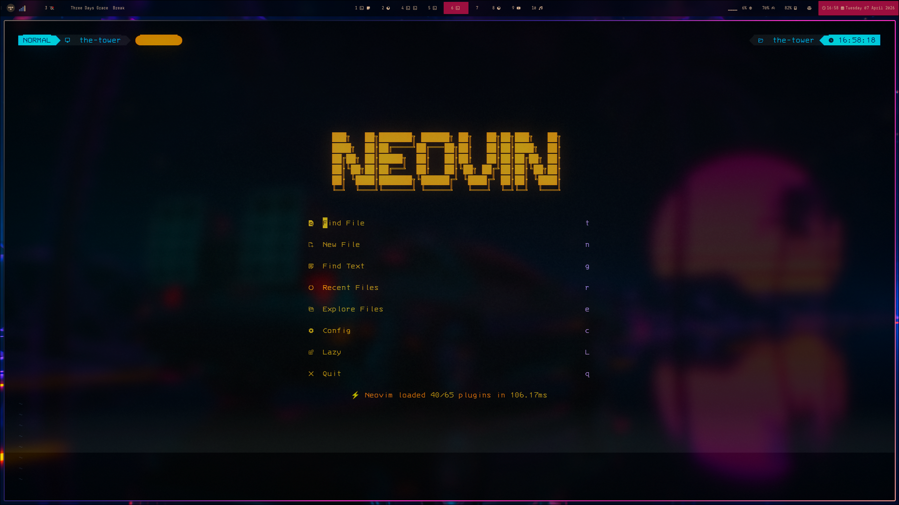
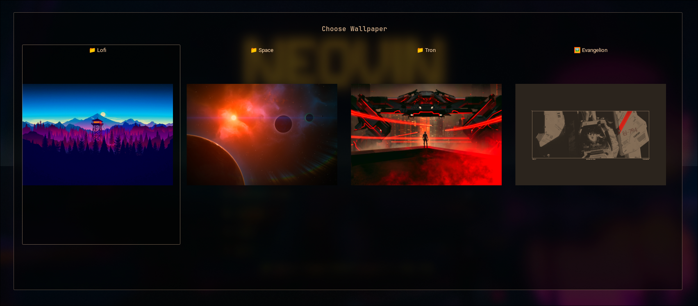
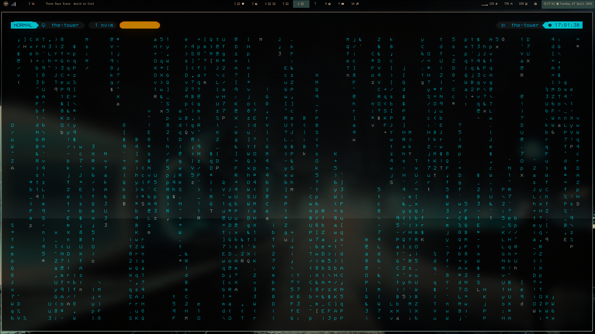

# The Tower

A declarative, modular Nix-flake configuration deploying a **Hyprland/Wayland desktop**
across **four NixOS hosts** (`notebook`, `main`, `server`, `wsl`).

Part of **The Grid** — a cohesive system architecture managed through Nix flakes.

---

## Showcase







---

## Overview

The Tower is a complete, reproducible desktop environment deployed across four NixOS
hosts that share a common Home Manager configuration and modular package definitions:

1. **`notebook`** — portable workstation
2. **`main`** — primary workstation
3. **`server`** — headless infra node (DNS + VPN, plus HTPC role)
4. **`wsl`** — NixOS-WSL target for Windows-side dev (see [docs/nixos-wsl.md](docs/nixos-wsl.md))

> **Deployment model:** all four are `nixosConfigurations` in `flake.nix` — there is
> **no** Home-Manager-standalone / Arch target. Each host pulls in Home Manager via
> `nix/hosts/<target>/home.nix`.

The stack:

- **Window Manager:** Hyprland (Wayland) — Hyprlock, Hypridle, Hyprpaper
- **Terminal & Shell:** Kitty + Fish + Starship + Tmux
- **Editor:** Neovim (lazy.nvim, native LSP, Treesitter, Snacks)
- **Utilities:** Yazi, Rofi, Lazygit, Ripgrep, FZF
- **Theming:** GTK (Sweet-Ambar-Blue-Dark), icons (Qogir-dark), fonts (JetBrains Mono /
  3270 Nerd Font), Wallust color generation
- **Wayland ecosystem:** Waybar, Sway Notification Center, hyprshade

All configuration is declarative, modular, and version-controlled.

---

## Documentation Map

The root README orients; each module's own docs are the **source of truth** for that tool.

| Module | Entry point | Covers |
|---|---|---|
| **Neovim** | [nvim/README.md](nvim/README.md) | Colemak layout, native LSP (13 langs), Snacks UI, keybindings, TaskNotes, Python/Android — full doc index |
| **Hyprland** | [hypr/README.md](hypr/README.md) | Modular Hyprland config, layouts, theming via Wallust, scripts, pyprland |
| **Tmux** | [tmux/TMUX_KEYBINDINGS.md](tmux/TMUX_KEYBINDINGS.md) · [tmux/TMUX_PLUGINS.md](tmux/TMUX_PLUGINS.md) | Colemak tmux keybindings + plugin setup (TPM) |
| **Swap architecture** | [docs/swap-architecture.md](docs/swap-architecture.md) | Two-layer swap (zram + randomEncryption), why static LUKS swap is a stage 1 bomb, fresh-install workflow |
| **Kanata** (WIP) | [docs/kanata-remapper.md](docs/kanata-remapper.md) | Cross-platform keyboard remapper — opt-in scaffold, not yet active. `keyd` remains the live remapper. |
| **Agent rules** | [CLAUDE.md](CLAUDE.md) · [AGENTS.md](AGENTS.md) | Repo architecture & rules for AI agents (Claude Code / OpenCode) |

> The remaining config dirs (`kitty/`, `fish/`, `rofi/`, `waybar/`, `yazi/`, …) have no
> standalone docs yet — they are plain config directories symlinked by `dotfiles.nix`.

---

## Directory Structure

```
.
├── flake.nix                # Flake entry — 3 nixosConfigurations + inputs
├── flake.lock
│
├── nix/                     # Nix definitions
│   ├── hosts/               # Per-host system config: notebook/ main/ server/ wsl/
│   │                        #   each has default.nix, hardware-configuration.nix, home.nix
│   │                        #   plus host-specific modules (e.g. main/nvidia.nix, main/storage.nix, server/htpc.nix, server/adguard.nix)
│   ├── home/                # Shared Home Manager modules (dotfiles.nix, git, gtk, tmux, xdg, …)
│   ├── packages/            # Categorical package lists → home.packages (cli, dev, languages, …)
│   ├── overlays/            # nixpkgs overlays (zen-browser, opencode, clingy, antigravity,
│   │                        #   claude-code, herdr, engram, codebase-memory-mcp, gemini-cli, pdf2md)
│   └── modules/             # Reusable NixOS modules
│
├── nvim/                    # Neovim config        → nvim/README.md
├── hypr/                    # Hyprland             → hypr/README.md
├── tmux/                    # Tmux                 → tmux/TMUX_KEYBINDINGS.md · TMUX_PLUGINS.md
├── kitty/ fish/ rofi/ waybar/ yazi/ starship/      # plain config dirs (symlinked by dotfiles.nix)
├── swaync/ wallust/ lazygit/ wezterm/ posting/
├── keyd/                    # keyd remapper (current) → see nix/modules/services.nix
├── kanata/                  # kanata remapper (WIP)  → docs/kanata-remapper.md
├── hyprshade/ themes/ fonts/ cool-retro-term/
└── docs/assets/             # showcase media
```

---

## Quick Start

### Prerequisites

- **NixOS** with Nix **flakes** enabled (`experimental-features = nix-command flakes`).
- Git.

> All three targets are NixOS system configurations — there is no Arch /
> Home-Manager-standalone path.

### Installation

1. **Clone:**
   ```bash
   git clone https://github.com/kasatto/the-tower ~/.the-grid/the-tower
   cd ~/.the-grid/the-tower
   ```

2. **Deploy your host** (`notebook` / `main` / `server`):
   ```bash
   sudo nixos-rebuild switch --flake .#notebook
   ```

3. **Reboot or restart the session** to activate Hyprland and services.

---

## Configuration

### Deployment Targets

`flake.nix` defines three `nixosConfigurations`:

| Target | Role | Command |
|--------|------|---------|
| **`notebook`** | Portable workstation | `sudo nixos-rebuild switch --flake .#notebook` |
| **`main`** | Primary workstation (NVIDIA GPU, secondary HDD on `/mnt/data`) | `sudo nixos-rebuild switch --flake .#main` |
| **`server`** | Headless infra node (DNS + VPN + HTPC) | `sudo nixos-rebuild switch --flake .#server` |
| **`wsl`** | NixOS-WSL target for Windows-side dev | `sudo nixos-rebuild switch --flake .#wsl` |

Test a host build without switching: `nixos-rebuild build --flake .#<target>`.

### Modular Structure

- **System** (`nix/hosts/<target>/`): `default.nix` (entry), `hardware-configuration.nix`,
  `home.nix` (per-host Home Manager), plus host modules (`audio.nix`, `services.nix`,
  `secrets/`).
- **Home Manager** (`nix/home/`): shared modules imported by each host's `home.nix` —
  `dotfiles.nix` (the symlink table), `git.nix`, `gtk.nix`, `tmux.nix`, `xdg.nix`,
  `sioyek.nix`, `polkit.nix`, `activation.nix`, `secrets.nix`.
- **Packages** (`nix/packages/`): categorical lists merged into `home.packages` —
  `cli.nix`, `dev.nix`, `languages.nix`, `latex.nix`, `nvim.nix`, `wayland.nix`,
  `appearance.nix`, `audio.nix`, `utilities.nix`, `cursor-theme.nix`, `ai.nix`,
  plus `custom/` for derivations not in nixpkgs.

> For the full architecture and agent workflow rules, see [CLAUDE.md](CLAUDE.md).

### Storage

- **Secondary HDD on `main`** — 1 TB WDC WD10SPZX (SMR, 5400 RPM) is mounted at
  `/mnt/data` via `nix/hosts/main/storage.nix` using a hardware-stable
  `/dev/disk/by-id/ata-WDC_WD10SPZX-...` reference. Used for photos, videos, static
  files, occasional Android SDK, and old projects. **Not for** build outputs,
  Nix store, or any random-write-heavy workload (SMR write-amplification penalty).
  See mount options in `storage.nix` (`noatime`, `lazytime`, `commit=60`,
  `errors=remount-ro`).
- **NVIDIA on `main`** — host-scoped env vars (GBM, EGL, GLX) live in
  `nix/hosts/main/nvidia.nix`. Shared `hypr/configs/env.conf` is GPU-agnostic.

### Swap architecture

`main` and `server` (both with encrypted root + a dedicated swap partition) use a
**two-layer swap** that replaced a single static LUKS swap. The original design was
a mandatory stage 1 dependency and silently timed out 90 s on every boot — invisible
until memory pressure surfaced it.

| Layer | Mechanism | Priority | Purpose |
|---|---|---|---|
| `zramSwap` | Compressed RAM-backed swap (zstd ~3×) | 5 (high) | Hot path; absorbs burst pressure at RAM speed |
| `randomEncryption` | `cryptsetup plainOpen -d /dev/urandom` on the swap partition at every boot | -2 (low) | Encrypted overflow; no persistent key, no passphrase prompt |

| Host | RAM | zram (raw / compressed) | disk swap | Total effective |
|---|---|---|---|---|
| `main` | 15 GiB | 7.8 / ~22.5 GiB | 17.1 GiB | ~39 GiB |
| `server` | 3.7 GiB | 1.85 / ~5.5 GiB | 8.2 GiB | ~13.7 GiB |

zram is critical on `server`: without it, the 3.7 GiB physical memory OOMs under any
pressure. The disk swap alone is too slow (5400 RPM) to absorb burst pressure.

For the full architecture, root-cause analysis from the fresh-install failure mode,
and the workflow for installing on new hardware, see
[docs/swap-architecture.md](docs/swap-architecture.md).

### Theming

- **GTK Theme:** Sweet-Ambar-Blue-Dark-v40
- **Icon Theme:** Qogir-dark
- **Fonts:** JetBrains Mono Nerd Font (primary), 3270 Nerd Font Mono (Kitty), Roboto, Inter
- **Color Generation:** Wallust (auto-generates colors from wallpapers)

Edit `nix/packages/appearance.nix` to change themes or fonts.

---

## Key Components

Each component links to its module doc, which is the source of truth.

### Neovim — [nvim/README.md](nvim/README.md)
lazy.nvim, native LSP across 13 languages, Treesitter, Snacks UI, **Colemak** navigation,
and an Obsidian/TaskNotes writing workflow.

### Hyprland — [hypr/README.md](hypr/README.md)
Wayland compositor with a modular config, Hyprlock (lock), Hypridle (idle), Hyprpaper
(wallpaper), and pyprland.

### Terminal & Shell — [tmux/TMUX_KEYBINDINGS.md](tmux/TMUX_KEYBINDINGS.md)
Kitty (GPU-accelerated, 3270 Nerd Font Mono), Fish, Starship prompt, and Tmux with
Colemak bindings ([plugins](tmux/TMUX_PLUGINS.md)).

### Utilities
Yazi (file manager), Rofi (launcher), Lazygit (git TUI), Ripgrep + FZF (search),
wl-clipboard (Wayland clipboard).

---

## Development

### Validating & building
```bash
nix flake check                         # validate flake syntax / evaluation
nixos-rebuild build --flake .#<target>  # build a host without switching
```

### Updating dependencies
```bash
nix flake update                        # bump all inputs
sudo nixos-rebuild switch --flake .#<target>
```

### Adding a package
1. Pick the category in `nix/packages/` (CLI → `cli.nix`, Wayland → `wayland.nix`,
   dev tool → `dev.nix`, etc.).
2. Append to `home.packages = with pkgs; [ ... ]`.
3. Rebuild the target.

### Adding a new app config
1. Create the config directory at the repo root (e.g. `appname/`).
2. Add a symlink entry in `nix/home/dotfiles.nix`:
   ```nix
   home.file.".config/appname".source = ../../appname;
   ```
3. **`git add`** the new directory, then rebuild.

> **Why `git add`?** `dotfiles.nix` maps each dir with `source = ../../<dir>; recursive = true`,
> which is a **flake store copy** — not a live symlink. Edits take effect only after a
> rebuild, and the flake copies **only git-tracked files**, so an untracked config is
> invisible until staged.

### Custom derivations
Place new derivations under `nix/packages/custom/` and reference them from a category
file (via the overlay where applicable).

---

## Troubleshooting

### Configuration won't apply
- Validate the flake: `nix flake check`
- Inspect the build in isolation: `nixos-rebuild build --flake .#<target>`
- System logs: `journalctl -xe`

### Wayland / Hyprland issues
- Verify Hyprland: `hyprctl version`
- Logs: `~/.cache/hyprland/` (or `journalctl --user`)
- Ensure the host's GPU drivers (AMD/NVIDIA) are configured.

### Font rendering issues
- Rebuild the font cache: `fc-cache -fv`
- Verify fonts: `fc-list | grep -i "jetbrains\|3270"`

### Rolling back a bad generation
- List system generations:
  `sudo nix-env --list-generations --profile /nix/var/nix/profiles/system`
- Roll back: `sudo nixos-rebuild switch --rollback` (or pick a previous generation from
  the boot menu).

---

## Credits & Attributions

This configuration incorporates code, scripts, and inspiration from the following
open-source projects:

- **[Arch-Hyprland](https://github.com/JaKooLit/Arch-Hyprland)** by **JaKooLit**: Several Hyprland scripts, configuration patterns, and theming logic.
- **[LazyVim](https://github.com/LazyVim/LazyVim)**: Inspiration for modular Neovim structure.
- **[NixOS Wiki](https://nixos.wiki/)**: Community-driven documentation and patterns.

---

## License

This project is licensed under the **GNU General Public License v3.0**. See the [LICENSE](LICENSE) file for the full text.

---

**Maintained by:** Nico (Kasatto)  
**Targets:** NixOS — `notebook` · `main` · `server` · `wsl` · Hyprland · Nix flakes  
**Last Updated:** 2026-07-28
